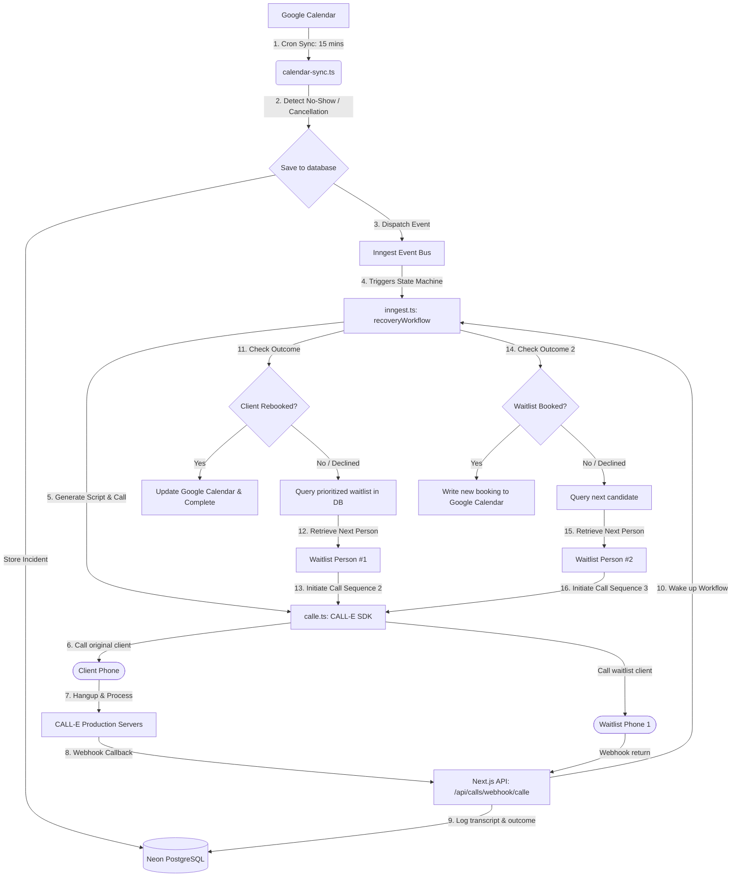

# System Architecture 🏗️

This document details the end-to-end system architecture of **RebookRelay**, showing how the calendar synchronization, background orchestration, and voice API layers interact.

---

## 🗺️ Architectural Workflow

The diagram below maps the complete cycle of a no-show incident being caught, processed, and recovered through the cascading waitlist.

---

## ⚙️ Core Technical Stack

### 1. Database Layer (Neon Postgres + Prisma)
We utilize a relational Postgres database hosted on Neon. The schema structures multi-tenancy:
*   **Clinics & Staff:** Authenticated accounts linked via unique workspace IDs.
*   **CalendarEvents:** Local cached events for state tracking and delta comparison.
*   **WaitlistPerson:** Clients grouped by service types, ordered dynamically by their **Priority Score**:
    $$\text{Priority Score} = \left(\frac{\text{Days Waiting}}{30}\right) \times 0.6 + (\text{Recency} \times 0.4)$$
*   **RecoveryCases & CallAttempts:** Audit logs showing cascade path metrics.

### 2. Orchestration State Machine (Inngest)
Because voice phone calls are synchronous and can take minutes, standard API endpoints would time out. RebookRelay leverages **Inngest** to build a durable serverless workflow. Inngest handles:
*   **Serverless Sleeps:** Pauses execution state machine until CALL-E completes the call.
*   **Decisions:** Determines if it should stop the run (on successful booking) or cascade to the next waitlist index.
*   **Resiliency:** Automatically handles retries and step caching to prevent duplicating phone calls.

### 3. Voice AI Endpoint (CALL-E SDK)
The unmocked integration calls the live CALL-E API using the `@call-e/calle` SDK:
*   **Structured Output:** Webhooks deliver JSON payloads detailing client intent, call sentiment analysis, and complete transcript turns.
*   **Compliance:** The system respects telecom regulations by verifying clinic telephone headers and ignoring invalid call routing parameters.
